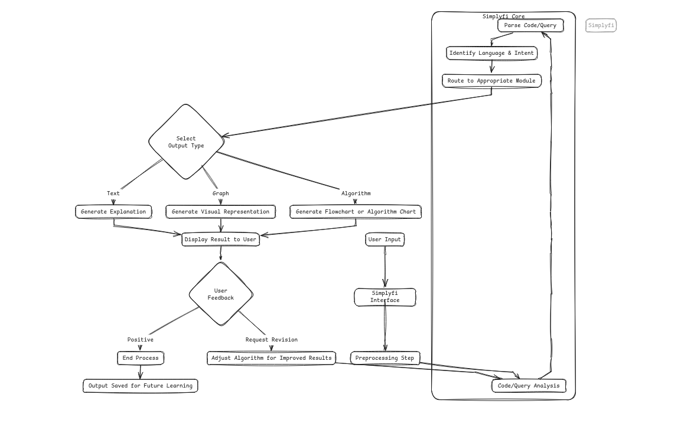

# Simplyfi

<div align="center">


A Multi-Language Code Analysis and Visualization Platform

[](https://opensource.org/licenses/MIT)
[](CONTRIBUTING.md)
[](https://www.python.org/downloads/)

</div>

## Table of Contents
- [Introduction](#introduction)
- [System Requirements](#system-requirements)
- [Technical Architecture](#technical-architecture)
- [Installation Guide](#installation-guide)
- [Configuration](#configuration)
- [Usage](#usage)
- [Development](#development)
- [API Reference](#api-reference)
- [Contributing](#contributing)
- [Support](#support)

## Introduction

### Overview
Simplyfi is an advanced code analysis platform that transforms source code into comprehensive visual representations. The platform employs sophisticated parsing algorithms to generate abstract syntax trees (ASTs) and flowcharts, facilitating code understanding and documentation.

### Key Capabilities
- Source code parsing and analysis across multiple programming languages
- Abstract Syntax Tree (AST) visualization
- Automated flowchart generation from code logic
- Interactive code explanation through natural language processing
- Customizable visualization parameters


### Dependencies
- Python packages are listed in `requirements.txt`
- Additional system libraries may be required based on your operating system

## Technical Architecture

Simplyfi implements a modular architecture designed for extensibility and maintainability:



### Core Components

#### 1. Input Processing Module
- Language detection and classification
- Syntax validation
- Code tokenization
- Query parsing and intent recognition

#### 2. Analysis Engine
- Abstract Syntax Tree (AST) generation
- Control flow analysis
- Data flow tracking
- Pattern recognition

#### 3. Visualization Pipeline
- Graph generation algorithms
- Layout optimization
- Style management
- Interactive element handling

#### 4. User Interface Layer
- Web-based interface
- Real-time updates
- User input handling
- Result presentation

### Data Flow
1. User input received through interface
2. Code/query parsed and validated
3. Analysis performed based on input type
4. Visual representation generated
5. Results displayed with interactive elements
6. User feedback collected and processed

## Installation Guide

### Prerequisites
Ensure your system meets the minimum requirements and has the following installed:
- Python 3.8+
- pip (Python package installer)
- Git
- virtualenv (recommended)

### Installation Steps

1. Clone the Repository
   ```bash
   git clone https://github.com/binarybardakshat/simplyfi.git
   cd simplyfi
   ```

2. Environment Setup
   ```bash
   # Create virtual environment
   python -m venv venv

   # Activate virtual environment
   # Windows
   .\venv\Scripts\activate
   # Unix/macOS
   source venv/bin/activate
   ```

3. Install Dependencies
   ```bash
   pip install -r requirements.txt
   ```

4. Configure Environment
   ```bash
   # Create configuration directory
   mkdir -p .streamlit
   
   # Create configuration file
   touch .streamlit/secrets.toml
   ```

5. Verify Installation
   ```bash
   python -m pytest tests/
   ```

## Configuration

### API Configuration
1. Obtain API Credentials
   - Navigate to [Google MakerSuite](https://makersuite.google.com/app/apikey)
   - Generate new API credentials
   - Save the API key securely

2. Configure API Access
   ```toml
   # .streamlit/secrets.toml
   [API_KEY]
   API_KEY = "your_api_key_here"
   ```

### Advanced Configuration
Additional configuration options can be set in `config.yaml`:
```yaml
visualization:
  default_theme: "light"
  export_formats: ["svg", "png", "pdf"]
  max_node_count: 1000

performance:
  cache_size: "512MB"
  worker_threads: 4
  timeout: 30

logging:
  level: "INFO"
  format: "%(asctime)s - %(name)s - %(levelname)s - %(message)s"
```

## Usage

### Basic Usage
1. Start the Application
   ```bash
   streamlit run app.py
   ```

2. Access the Interface
   - Open web browser
   - Navigate to `http://localhost:8501`

## Development

### Development Setup
1. Install Development Dependencies
   ```bash
   pip install -r requirements-dev.txt
   ```

2. Configure Pre-commit Hooks
   ```bash
   pre-commit install
   ```

### Testing
```bash
# Run test suite
pytest

# Run with coverage
pytest --cov=simplyfi tests/

# Generate coverage report
coverage html
```

### Code Style
- Follow PEP 8 guidelines
- Use type hints
- Maintain test coverage above 90%
- Document all public APIs

## API Reference

### Core Classes

#### CodeAnalyzer
```python
class CodeAnalyzer:
    """
    Main class for code analysis operations.
    """
    def analyze(self, source: str) -> Analysis:
        """
        Analyze source code and return analysis results.
        
        Args:
            source: Source code or file path
            
        Returns:
            Analysis object containing results
        """
        pass
```

#### Visualization
```python
class Visualization:
    """
    Handles visualization generation and export.
    """
    def generate(self, analysis: Analysis) -> None:
        """
        Generate visualization from analysis results.
        """
        pass
```

## Contributing

### Contribution Process
1. Fork the repository
2. Create a feature branch
3. Implement changes
4. Add/update tests
5. Update documentation
6. Submit pull request

### Code Standards
- Follow existing code style
- Include unit tests
- Update documentation
- Maintain backward compatibility
- Add type hints

### Pull Request Guidelines
1. Use descriptive commit messages
2. Reference relevant issues
3. Update CHANGELOG.md
4. Ensure CI passes
5. Obtain code review approval

## Support

### Official Channels
- GitHub Issues: Bug reports and feature requests
- Email Support: binarybardakshat@gmail.com
- Documentation: [Project Wiki](https://github.com/binarybardakshat/simplyfi/wiki)

### Common Issues
- API Authentication
  - Verify API key format
  - Check network connectivity
  - Confirm API service status

- Visualization
  - Validate input format
  - Check memory usage
  - Verify browser compatibility
  - 
## License

This project is licensed under the MIT License. See the [LICENSE](LICENSE) file for details.

---

<div align="center">
Copyright © 2024 Simplyfi Project Contributors. All rights reserved.
</div>
